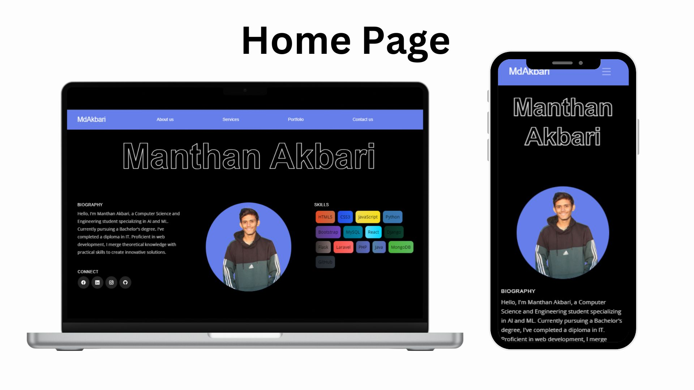
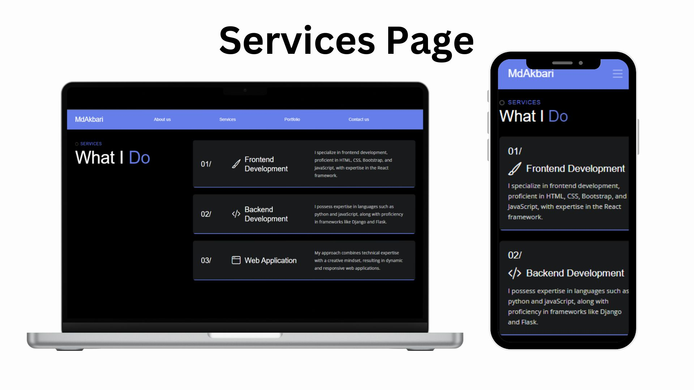
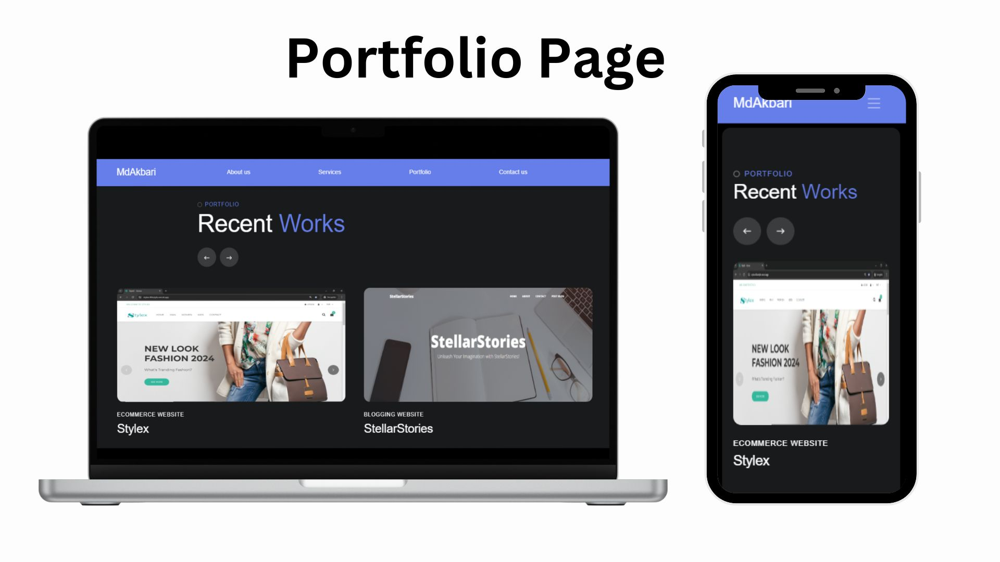
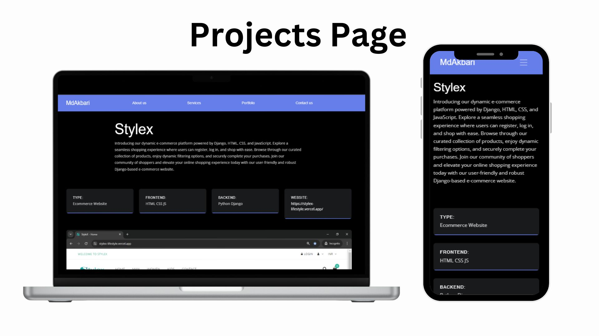
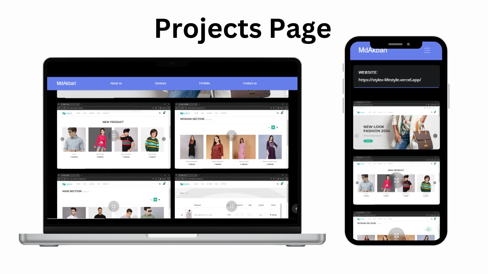
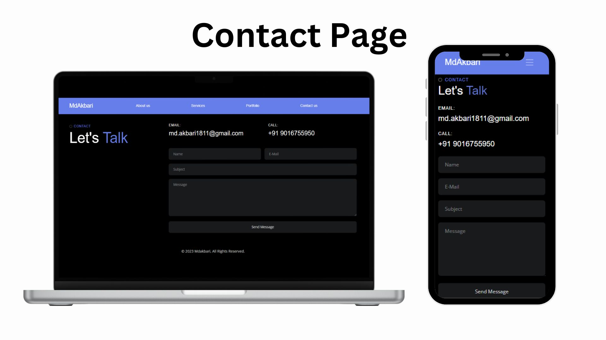

<h1 align="center" style="color: #667EEA">Manthan Akbari</h1>

<h2 style="color: #667EEA">Project Overview</h2>

This project is a simple implementation of a personal portfolio website. The website is responsive and can be viewed on any device.

<h2 style="color: #667EEA">Live demo</h2>

<h2 style="color: #667EEA">Technologies Used</h2>

### 👉 Frontend:-

   
   
   
  

### 👉 Backend:-

  
  
  

<h2 style="color: #667EEA">Features</h2>
<ul>
  <li>Responsive Design</li>
  <li>Contact Form</li>
  <li>Portfolio Section</li>
  <li>About Section</li>
  <li>Services Section</li>
</ul>

<h2 style="color: #667EEA">Snapshots</h2>

### 👉 Home Page

### 👉 Service Page

### 👉 Portfolio Page

### 👉 Projects Page

### 👉 Projects Page

### 👉 Contact Page

<h2 style="color: #667EEA">Usage Instructions</h2>

To run this project locally:

<ol>
  <li>Clone the repository: <code>git clone https://github.com/mdakbari/portfolio.git</code></li>
  <li>Navigate to the project directory: <code>cd portfolio</code></li>
  <li>Set up the database</li>
  <li>Configure the database connection in <code>db.php</code></li>
  <li>Start the server: <code>php -S localhost:8000</code></li>
  <li>Open the browser and navigate to <code>http://localhost:8000</code></li>
</ol>

<h2 style="color: #667EEA" >Contact</h2>

* Feel free to contact me if you need any help

    &nbsp;&nbsp;
    &nbsp;&nbsp;
    &nbsp;&nbsp;

